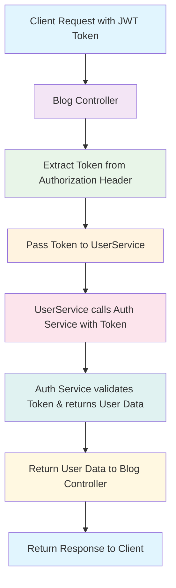

# JWT Token Flow in Microservices Architecture

This diagram shows how JWT tokens are passed from the client through the Blog service to the Auth service for user data retrieval.

## Flow Diagram

## Components

- **Client**: External application making requests
- **Blog Controller**: Main API endpoint that handles blog requests
- **UserService**: Service that fetches user data from Auth service
- **Auth Service**: Authentication service that validates tokens and returns user data

## Key Changes Made

1. **Token Extraction**: Blog controller extracts JWT token from Authorization header
2. **Token Passing**: Token is passed as parameter to UserService methods
3. **Direct Usage**: UserService uses the token directly instead of generating new service tokens
4. **Validation**: Auth service validates the token and returns user data

## Benefits

- 🚀 **More Efficient**: Reuses existing JWT token
- 🔒 **Secure**: Maintains security using validated tokens  
- 🧹 **Cleaner**: Eliminates complex service-to-service authentication
- ⚡ **Faster**: No additional token generation overhead
- 🔄 **Consistent**: Uses same token throughout request lifecycle 